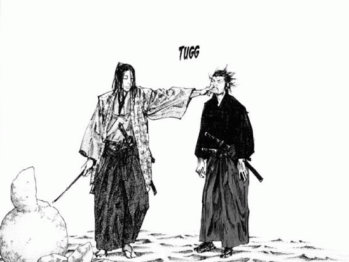

<h3> 👋 Yo! I'm Uzu! </h3> 
<h3> 🤡 I'm just *Cu210u5 Boy! </h3>
<h3> 💥 In my bio you can see the things that interest me! </h3>

#

<p align="center"></p>

#

#### _```🚀 - Operational Systems:```_


#

#### _```📦 - Code Editing:```_


#

#### _```🤖 - Favorite Languages:```_


#

#### _```🛠️ - Github Stats:```_ 
<div align="center">
  
  
</div>

#
